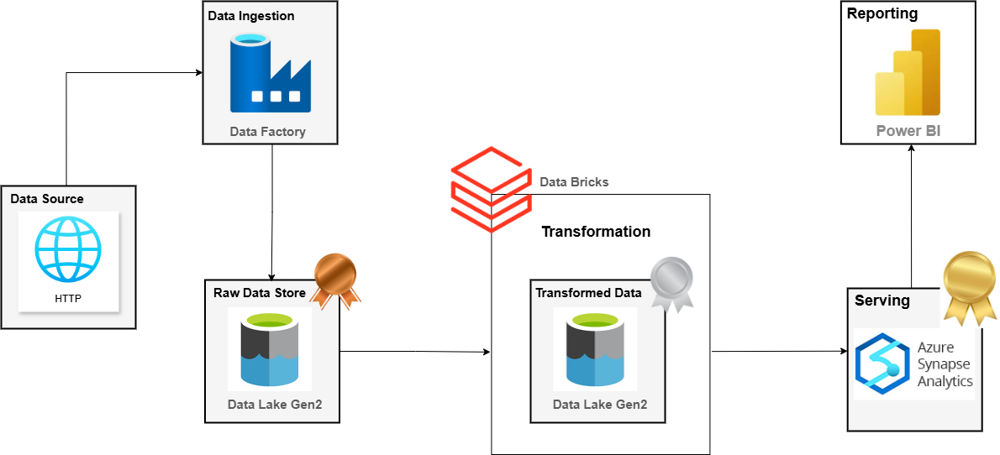
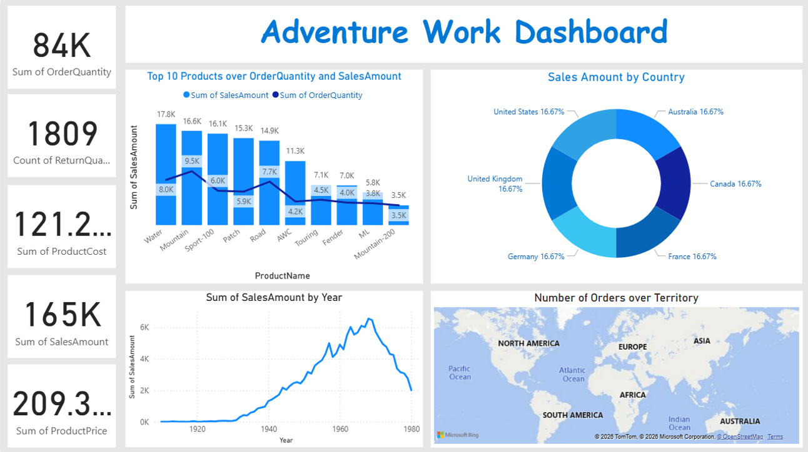

# azure-adventurework

---
## 📌 Overview
This project demonstrates an end-to-end **Data Engineering pipeline** built on Azure, following the **Medallion Architecture (Bronze–Silver–Gold)**. The pipeline ingests data from external sources, processes and transforms it, and serves it for analytical reporting.

### 🔄 Data Flow:
1. **Data Source (HTTP)**
   - Data is extracted from GitHub via HTTP requests

2. **Data Ingestion (Azure Data Factory)**
   - Automated pipelines ingest raw data into the Data Lake

3. **Bronze Layer (Raw Data)**
   - Stores raw, unprocessed data in Azure Data Lake Gen2

4. **Data Transformation (Databricks - PySpark)**
   - Cleans, transforms, and standardizes data

5. **Silver Layer (Cleaned Data)**
   - Stores processed and structured data

6. **Serving Layer (Azure Synapse Analytics)**
   - Data warehouse designed using **Fact Constellation Schema**
   - Supports analytical queries

7. **Gold Layer (Business-ready Data)**
   - Optimized data for reporting and BI

8. **Reporting (Power BI)**
   - Interactive dashboards for business insights

## 🏗️ System Architecture

---

---

## ⚙️ Technologies Used

- **Azure Data Factory** – Data ingestion & orchestration  
- **Azure Data Lake Gen2** – Storage (Bronze & Silver layers)  
- **Databricks (PySpark)** – Data transformation  
- **Azure Synapse Analytics** – Data warehouse (Serving layer)  
- **Power BI** – Data visualization & reporting  

---

## 📊 Dashboard Overview

---
